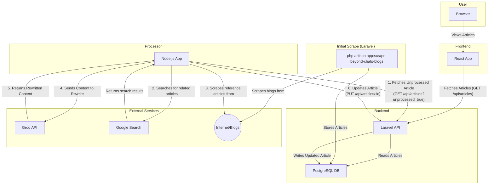

# BeyondChats Scraper and Content Engine

This project is a multi-part system for scraping articles, processing them with AI, and displaying them. It consists of three main components:

1.  **Backend (`beyondchats-scraper`)**: A Laravel application that serves as the API and database layer.
2.  **Frontend (`frontend`)**: A React application to display the articles.
3.  **Node App (`node-app`)**: A Node.js script for processing articles with an AI model.

## Getting Started

These instructions will get you a copy of the project up and running on your local machine for development and testing purposes.

### Prerequisites

You will need the following software installed on your machine:

*   PHP (>= 8.1)
*   Composer
*   Node.js (>= 16.x)
*   npm
*   Git

### Installation

Follow these steps to set up the project:

1.  **Clone the repository:**

    ```bash
    git clone https://github.com/Goutamsahu23/BeyondChats.git
    cd BeyondChats
    ```

2.  **Backend Setup (Laravel):**

    ```bash
    cd beyondchats-scraper
    composer install
    cp .env.example .env
    ```

    Next, configure your `.env` file with your database credentials. For PostgreSQL, it should look something like this:

    ```env
    DB_CONNECTION=pgsql
    DB_HOST=127.0.0.1
    DB_PORT=5432
    DB_DATABASE=your_db_name
    DB_USERNAME=your_db_user
    DB_PASSWORD=your_db_password
    ```

    Make sure you have created the database in your PostgreSQL server.

    Finally, run the migrations:

    ```bash
    php artisan key:generate
    php artisan migrate
    php artisan app:scrape-beyond-chats-blogs
    cd ..
    ```

3.  **Frontend Setup (React):**

    ```bash
    cd frontend
    npm install
    cd ..
    ```

4.  **Node App Setup:**

    ```bash
    cd node-app
    npm install
    cp .env.example .env
    ```

    You will need to edit the newly created `.env` file and add your Groq API key:

    ```env
    LARAVEL_API_BASE=http://127.0.0.1:8000/api
    GROQ_API_KEY=your_groq_api_key_here
    SERP_API_KEY=your_api
    ```
    
    ```bash
    cd ..
    ```

### Running the Application

To run the project, you will need to start the backend and frontend servers in separate terminals.

1.  **Start the Laravel Backend:**

    ```bash
    cd beyondchats-scraper
    php artisan serve
    ```

    The backend will be running at `http://127.0.0.1:8000`.

2.  **Start the React Frontend:**

    In a new terminal:

    ```bash
    cd frontend
    npm start
    ```

    The frontend will be running at `http://localhost:3000` and will open automatically in your browser.

3.  **Run the Node.js Scraper/Processor:**

    The Node.js app is a command-line script that fetches the latest unprocessed article, uses an AI to rewrite it, and then saves it back to the database via the Laravel API.

    In a new terminal:

    ```bash
    cd node-app
    node src/index.js
    ```

    You can run this script whenever you want to process a new article.

## Architecture Diagram



## How it Works

1.  **Initial Scrape**: The `php artisan app:scrape-beyond-chats-blogs` command is run to scrape blog posts from beyondchats.com and store them in the PostgreSQL database.
2.  **Viewing Articles**: The user opens the **React frontend** in their browser, which fetches the list of articles from the **Laravel backend** and displays them.
3.  **AI Processing**:
    - The **Node.js script** is run manually.
    - It fetches the latest article from the backend that has not yet been processed.
    - It performs a Google search for related articles to use as references.
    - It sends the original article content and the reference material to the **Groq API** to be rewritten.
    - It receives the rewritten content and updates the article in the database via the **Laravel API**.
4.  **Displaying Updates**: The React frontend periodically refreshes, showing the newly updated AI content alongside the original.